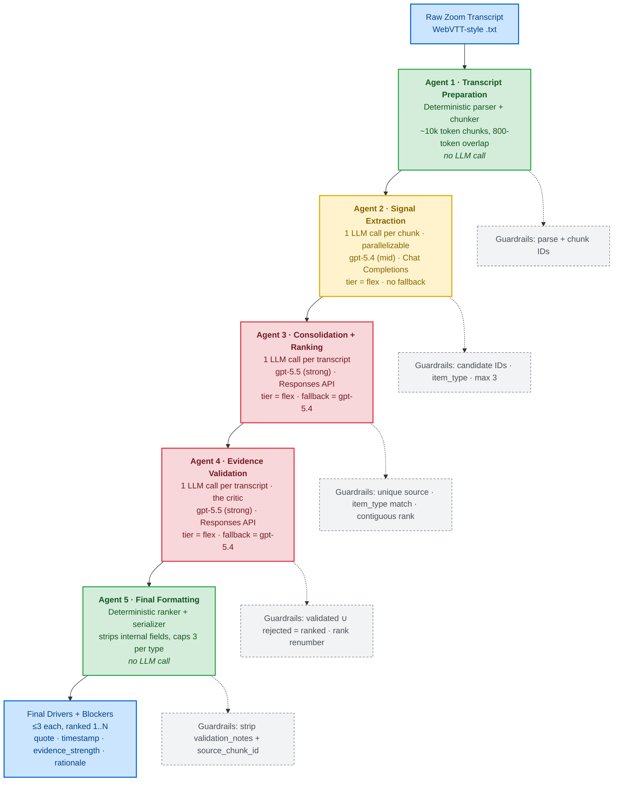
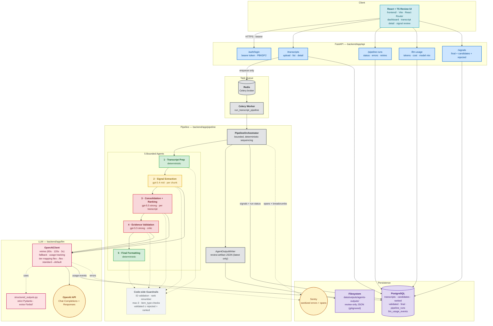

# Advisor Signal Extraction

Production-minded LLM pipeline that extracts decision-relevant **drivers** and **blockers** from real Zoom transcripts of conversations between Optimize Corporate Development representatives and prospective financial advisors.

For each transcript the system returns up to **three drivers** and up to **three blockers**, each grounded in a verbatim advisor quote with an explicit/implied evidence strength and a short rationale. It is **not** a call-summary tool — the goal is high-precision, evidence-grounded recruiting intelligence.

The authoritative spec is [`AGENTS.md`](./AGENTS.md). This README is the presentation-facing summary.

---

## 1. Project Layout

```text
backend/    FastAPI API, Celery worker, pipeline orchestrator, 5 agents, persistence
  app/prompts/        Versioned production prompts (_v1.md)
  app/llm/            Centralized OpenAI client, structured-output schemas, pricing
  app/pipeline/       Orchestrator + agents (transcript_preparation, signal_extraction, ...)
  scripts/            Per-agent + full-pipeline smoke scripts (--dry-run-input supported)
  tests/              Mocked-OpenAI tests for every agent
frontend/   React + TS internal review UI (transcripts, signals, runs, usage analytics)
shared/     Generated JSON schemas and OpenAPI contracts only
infra/      Docker / Nginx / Postgres
data/       Local sanitized samples only (real transcripts are gitignored)
```

---

## 2. Architecture and Workflow

### 2.1 Overall workflow

A **bounded, deterministically-orchestrated multi-agent pipeline** — not an autonomous agent loop. Each step has a constrained job, a strict structured-output schema, and code-side guardrails that run after every LLM call.

#### 2.1.1 Agentic workflow



Legend — <span style="color:#155724">**green**</span>: deterministic, no LLM · <span style="color:#856404">**amber**</span>: mid-tier model (`gpt-5.4`) · <span style="color:#721c24">**red**</span>: strong model (`gpt-5.5`) with mid-tier fallback · <span style="color:#0366d6">**blue**</span>: pipeline I/O · dashed grey: post-step code-side guardrails.

#### 2.1.2 System architecture (backend + agentic workflow)



#### 2.1.3 ASCII flow (text fallback)

```text
Raw Zoom transcript (.txt, WebVTT-style)
        │
        ▼
FastAPI  POST /transcripts                     (auth-protected, enqueues only)
        │
        ▼
Celery task  run_transcript_pipeline           (worker boundary; never API)
        │
        ▼
PipelineOrchestrator
        │
        ├─► [1] TranscriptPreparationAgent     deterministic parser/chunker   no LLM
        │
        ├─► [2] SignalExtractionAgent          1 LLM call per chunk           gpt-5.4  (mid)
        │                                       Chat Completions structured parsing
        │
        ├─► [3] ConsolidationRankingAgent      1 LLM call per transcript      gpt-5.5  (strong)
        │                                       Responses API   tier=flex       fallback=gpt-5.4
        │
        ├─► [4] EvidenceValidationAgent        1 LLM call per transcript      gpt-5.5  (strong)
        │                                       Responses API   tier=flex       fallback=gpt-5.4
        │
        └─► [5] FinalFormattingAgent           deterministic ranker/serializer  no LLM
        │
        ▼
Code-side guardrails  (ID validation, rank renumbering, item_type checks, max-3 per type)
        │
        ▼
PostgreSQL  candidates + ranked + validated + final + llm_usage_events  (full audit trail)
        │
        ▼
React review UI    drivers/blockers + advisor quote + timestamp + evidence_strength + rationale
```

### 2.2 Why this design

- **Bounded, not autonomous.** The task is narrow and evidence-sensitive. Free-running agent loops trade precision for unpredictable cost and weak auditability — the opposite of what recruiting intelligence needs.
- **One agent per concern.** Extraction looks locally per chunk, ranking looks globally, validation is the critic, and final formatting is a deterministic ranker/serializer. Separating these lets us swap models per step (or remove them entirely, as we did for Agent 5) and keeps prompts short and testable.
- **Structured outputs everywhere.** Every LLM call uses `client.responses.parse(text_format=Model)` or `client.beta.chat.completions.parse(response_format=Model)` against strict Pydantic schemas (`extra="forbid"`). No free-form JSON in production paths.
- **Code, not the model, enforces invariants.** IDs, max-3-per-type, contiguous ranks, source-`item_type` agreement, and `validated ∪ rejected = ranked` are all enforced after the LLM call.

### 2.3 Model choice and rationale

| Step | Model | Endpoint | Tier | Fallback | Why |
|---|---|---|---|---|---|
| 1. Transcript prep | — | — | — | — | Deterministic parsing; no model judgment needed |
| 2. Extraction | `gpt-5.4` (mid) | Chat Completions | flex | none | Per-chunk, independent, cheap; mid model has enough judgment |
| 3. Ranking | `gpt-5.5` (strong) | Responses | flex | `gpt-5.4` | Cross-segment prioritization needs strong reasoning; flex is the default cost guardrail |
| 4. Validation | `gpt-5.5` (strong) | Responses | flex | `gpt-5.4` | False positives are the highest-risk failure; precision premium |
| 5. Final format | — | — | — | — | Deterministic ranker/serializer — sorts by `rank`, caps 3 per `item_type`, strips internal fields. No model judgment needed; removes a source of drift in the public output. |

The Chat Completions / Responses split is intentional: `gpt-5.5` was unstable on Chat Completions structured parsing, while it parses reliably through Responses. Model IDs live in `app/core/config.py` and are persisted with every usage event so historical costs and behavior stay explainable across model upgrades.

### 2.4 How long or messy transcripts are handled

- **TranscriptPreparationAgent** parses WebVTT-style Zoom exports (`HH:MM:SS.mmm --> HH:MM:SS.mmm [SPEAKER]: text`), with fallbacks for plain `Speaker: text` and a single `Unknown` turn for unstructured text.
- Header metadata (`Meeting ID`, `Host Email`, `Start Time`) is extracted before the first turn marker.
- Exact-duplicate turns (same timestamp, speaker, text) are removed; nothing else is summarized away — verbatim quotes are required downstream.
- Chunking targets **~10 000 estimated tokens** with up to **8 turns / 800 tokens of overlap**, on speaker boundaries, with stable IDs `{transcript_id}_chunk_001`. Token estimate is `ceil(chars/4)`.
- Chunks let Agent 2 run **in parallel** in production and bound any single LLM call's input.

### 2.5 Distinguishing advisor signals from rep-led discussion

- Role inference at the parser level: `ADVISOR*` → `advisor`; `OPTIMIZE_REP` / `REP` / `CORPORATE_DEVELOPMENT` → `optimize_rep`; ambiguous labels stay `unknown` (no aggressive guessing).
- The extraction prompt explicitly tells the model: "Optimize representative claims are not signals unless the advisor clearly adopts or endorses the point." Polite interest ("sounds good"), scheduling, and clarification questions are listed as rejection examples in the prompt.
- The validation agent re-checks attribution against the actual source chunk turns and rejects items whose quote isn't an advisor turn (or a clear advisor endorsement).

### 2.6 Ranking business importance

Agent 3 ranks against five explicit criteria in `consolidation_ranking_v1.md`:

1. **Decision relevance** — would it actually affect whether the advisor moves forward?
2. **Advisor ownership** — did the advisor state or clearly endorse it?
3. **Specificity** — concrete pain/economics/transition constraint, not generic curiosity.
4. **Gating power or urgency** — could it accelerate, prevent, or delay action?
5. **Evidence strength** — explicit beats implied.

Then the orchestrator enforces, in code: max 3 per `item_type`, unique source candidates, `item_type` agreement with the selected source, and contiguous ranks starting at 1 within each item type.

### 2.7 Validating evidence

Agent 4 is the critic. For every ranked item the model must verify:

- The quote appears verbatim or near-verbatim in the transcript.
- The quote is from the advisor (or clearly endorsed by the advisor).
- The quote supports the stated category and rationale.
- The item is decision-relevant and not polite/scheduling/clarification/rep-led messaging.

To make the critic's job possible, the agent input includes pre-built **evidence contexts**: for each ranked signal we pass the source chunk's turns (or, if the normalized advisor quote appears in the chunk, the matching advisor turn plus nearby turns). If no normalized match is found, the full source chunk is included so the critic can judge near-verbatim rewrites.

Output is `{validated_signals, rejected_signals}`. Code-side guardrails require **every ranked signal to appear exactly once across the two lists** (rejections stay auditable), and remaining validated signals are renumbered contiguously per `item_type` before final formatting — so public output never has rank gaps like `1, 3`.

### 2.8 Handling uncertainty, weak evidence, or empty outputs

- All schemas allow **empty lists** — returning zero drivers or zero blockers is a first-class outcome, not an error.
- The extraction prompt says "If no advisor-owned, decision-relevant signal is supported, return an empty `candidates` list."
- Agent 3 returns `[]` without an LLM call when no candidates exist; Agents 4 and 5 short-circuit similarly. This avoids paying for and trusting a model decision on empty input.
- `evidence_strength` is `explicit` only when the advisor states it directly; `implied` is documented as "use sparingly" and is preserved through the pipeline so reviewers can filter.
- Rejected candidates are persisted with `rejection_reason` and `validation_notes` so SMEs can inspect what the system threw away.

### 2.9 Scaling in production

- **Per-chunk parallelism** — Agent 2 is embarrassingly parallel; in production it can fan out across worker concurrency.
- **Worker isolation** — API routes only enqueue Celery tasks; the worker pool scales independently of the API.
- **Tiered models** — Agent 2 runs on the cheaper mid-tier model; Agent 5 is fully deterministic (no LLM); only Agents 3 and 4 use the strong reasoning model.
- **Bounded retries with fallback** — the centralized client retries transient errors (429 / 5xx / timeout / connection) with **60 s, then 120 s** backoff (3 attempts). After primary retries exhaust on transient errors, Agents 3 and 4 try the mid-tier fallback model. Never retries/fallbacks on `BadRequestError` or `ValidationError` — those are configuration/schema bugs to fix.
- **Service tier** — repo-facing `flex` is the default (cheaper, higher tolerated latency); use `standard` only as an explicit override for a latency-sensitive run.
- **Audit-friendly persistence** — candidates, ranked, validated, rejected, and final signals are all persisted, so re-running a step or re-validating with a new prompt version doesn't require re-running the whole pipeline.

---

## 3. Production-Ready Prompting Approach

The exact production prompts live as individual files under [`backend/app/prompts/`](./backend/app/prompts/), one per pipeline step, with explicit version suffixes:

| Step | Prompt file | Prompt version |
|---|---|---|
| Transcript preparation (notes only — deterministic) | [`transcript_preparation_v1.md`](./backend/app/prompts/transcript_preparation_v1.md) | `transcript_preparation_v1` |
| Signal extraction | [`signal_extraction_v1.md`](./backend/app/prompts/signal_extraction_v1.md) | `signal_extraction_v1` |
| Consolidation + ranking | [`consolidation_ranking_v1.md`](./backend/app/prompts/consolidation_ranking_v1.md) | `consolidation_ranking_v1` |
| Evidence validation (critic) | [`evidence_validation_v1.md`](./backend/app/prompts/evidence_validation_v1.md) | `evidence_validation_v1` |
| Final formatting (retained for reference — no longer used at runtime) | [`final_formatting_v1.md`](./backend/app/prompts/final_formatting_v1.md) | _n/a (deterministic agent)_ |

Prompt versions are **persisted with every LLM usage record** so a future eval can isolate the effect of a prompt change. Iteration history for each prompt lives under [`backend/app/prompts/v2/`](./backend/app/prompts/v2) and [`v3/`](./backend/app/prompts/v3) — `_v1.md` is the production-canonical version.

### 3.1 Structured output schemas

All output schemas live in [`backend/app/llm/structured_outputs.py`](./backend/app/llm/structured_outputs.py) and use Pydantic with `ConfigDict(extra="forbid")`. Examples:

```python
class SegmentCandidateSignalOutput(BaseModel):
    model_config = ConfigDict(extra="forbid")
    item_type: SignalType                       # "driver" | "blocker"
    category: str = Field(min_length=1)
    advisor_quote: str = Field(min_length=1)
    timestamp: str | None = None
    evidence_strength: EvidenceStrength         # "explicit" | "implied"
    rationale: str = Field(min_length=1)

class SegmentSignalExtractionResult(BaseModel):
    model_config = ConfigDict(extra="forbid")
    candidates: list[SegmentCandidateSignalOutput] = Field(default_factory=list)
```

### 3.2 OpenAI API call — Agent 2 (Chat Completions structured parsing)

Used for per-chunk extraction because mid-tier models parse reliably on Chat Completions:

```python
# backend/app/llm/openai_client.py  (excerpt)
request = {
    "model": "gpt-5.4",                                  # OPENAI_MODEL_MID
    "service_tier": "flex",                              # cost-optimized default
    "messages": [
        {"role": "system", "content": signal_extraction_v1_prompt},
        {"role": "user",
         "content": json.dumps(chunk_input_payload, ensure_ascii=False, separators=(",", ":"))},
    ],
    "response_format": SegmentSignalExtractionResult,    # strict Pydantic schema
    "max_completion_tokens": 2000,
}
response = client.beta.chat.completions.parse(**request)
parsed: SegmentSignalExtractionResult = response.choices[0].message.parsed
```

Input payload (one per chunk):

```json
{
  "transcript_id": "call_001",
  "chunk_id": "call_001_chunk_001",
  "start_timestamp": "00:00:00",
  "end_timestamp": "00:10:30",
  "turns": [
    {"sequence": 1, "timestamp": "00:01:00", "speaker": "Advisor",
     "speaker_role": "advisor", "text": "I need stronger operations support."}
  ]
}
```

### 3.3 OpenAI API call — Agents 3 / 4 (Responses API structured parsing)

Used for transcript-level reasoning because `gpt-5.5` is stable on Responses but unstable on Chat Completions structured parsing. Agent 5 is deterministic and does **not** call OpenAI:

```python
# backend/app/llm/openai_client.py  (excerpt)
request = {
    "model": "gpt-5.5",                                  # OPENAI_MODEL (strong)
    "service_tier": "flex",                              # cost-optimized default
    "instructions": consolidation_ranking_v1_prompt,
    "input": json.dumps(ranking_input_payload, ensure_ascii=False, separators=(",", ":")),
    "text_format": ConsolidationRankingResult,           # strict Pydantic schema
    "max_output_tokens": 6000,                           # 2000 truncated on larger candidate sets
}
response = client.responses.parse(**request)
parsed: ConsolidationRankingResult = response.output_parsed
```

### 3.4 Cross-cutting parameters (every call)

- **Temperature**: pulled from config (`settings.openai_temperature`); only sent when not `None` so reasoning models that reject `temperature` aren't broken.
- **Service tier**: repo-facing `flex` by default; pass repo-facing `standard` only for an explicitly latency-sensitive call. The client maps repo `standard` → API `default` (the API accepts `auto | default | flex | priority`, not literal `standard`).
- **Retries**: 3 attempts, initial 60 s backoff doubling each retry (60 s, 120 s). Retries **only** transient errors (429, 5xx, `APITimeoutError`, `APIConnectionError`, `InternalServerError`, `RateLimitError`). Never retries `BadRequestError` or Pydantic `ValidationError`.
- **Fallback**: Agents 3 & 4 fall back to the mid-tier model **only** after primary retries are exhausted on a transient error. Same prompt / payload / schema / endpoint / tier on the fallback call so usage tracking stays comparable.
- **Usage**: every attempt persists a row in `llm_usage_events` — model, prompt_version, input/output/total tokens, latency, retry count, status, error type, estimated cost, and pricing version.

### 3.5 Code-side guardrails after every LLM call

The model is never trusted to set IDs or enforce invariants. After parsing:

- `transcript_id` and `source_*_id` are taken from the prepared transcript / source candidate, never from model output.
- Every model-supplied `source_candidate_id` / `source_ranked_signal_id` / `source_validated_signal_id` must exist, be unique, and have an `item_type` that matches its source.
- Max 3 per `item_type`; ranks renumbered contiguously starting at 1 within each `item_type` after any drops.
- Agent 4 requires every ranked signal to appear exactly once across `validated_signals ∪ rejected_signals`.
- Agent 5 (deterministic) groups by `item_type`, sorts by `rank`, caps at 3 per type, renumbers ranks contiguously starting at 1, and strips internal fields (`validation_notes`, `source_chunk_id`) from the public output.

---

## 4. Self-Assessment

No SME ground truth was available, so this is a candid self-review against the sample transcripts in `data/sample_transcripts/`.

### 4.1 Where the system handled transcripts well

- **Clear, advisor-led conversations** with explicit driver/blocker statements (e.g. "the transition is what worries me most", "I want better economics") — the per-chunk extraction surfaces them, the critic keeps them, and ranks usually align with what a human would pick top-1.
- **Long Zoom transcripts** parsed correctly thanks to the WebVTT-aware parser and 10k-token chunking with overlap; we don't lose evidence at chunk boundaries.
- **Rep-led sales sections** with passive advisor agreement — the extraction prompt's explicit rejection list (polite interest, scheduling, clarification) does most of the work, and Agent 4 catches the rest.
- **Empty / null-signal transcripts** — returning zero drivers is treated as a valid outcome end-to-end, so we don't manufacture signals to fill slots.

### 4.2 Where transcripts were ambiguous or difficult

- **Implied / inferred signals** — advisors who hint at frustration without naming it. We err on the side of `implied` `evidence_strength` or rejection, which favors precision but may miss real drivers.
- **Mixed-attribution turns** where the rep paraphrases the advisor and the advisor only says "yeah". The parser can't tell whether the "yeah" is an endorsement of the substantive content; Agent 4 sometimes rejects these, sometimes keeps them.
- **Speaker-label ambiguity** — when Zoom labels are generic ("Speaker 1") the parser keeps them as `unknown` rather than guessing, which means some real advisor signals are dropped because they can't be attributed.
- **Long monologues with multiple sub-signals** — extraction occasionally captures one quote and misses a second, related driver in the same turn.

### 4.3 Lowest-confidence outputs

- Any candidate marked `evidence_strength: "implied"`.
- Items whose advisor quote is short and could plausibly be a back-channel.
- Items from chunks with high `unknown` speaker density.
- Items where Agent 4's validation notes mention "near-verbatim" or "endorsement inferred".

### 4.4 What we'd ask a business stakeholder / SME to review

- All `implied` items — keep, downgrade, or reject?
- The category taxonomy that emerged from the prompts (`Transition complexity`, `Operational support`, `Compensation economics`, `Decision dependency`, …) — does it match how Corporate Development actually triages calls?
- A sample of rejected candidates — false negatives are invisible to the system but visible to an SME reading the transcript.
- Edge cases: stakeholder-dependency blockers ("I need to talk to my partner") — are these high or low priority?

### 4.5 How we'd evaluate this system if SME labels were available

- **Precision and recall** for drivers and blockers, separately.
- **Top-1 ranking precision** (does our rank-1 driver match the SME's most-important driver?).
- **Quote-match rate** (exact vs. acceptable near-verbatim).
- **Advisor-attribution accuracy** — what % of our outputs are actually advisor-owned.
- **False-positive rate** on polite-interest and rep-led messaging — the failure mode that hurts trust most.
- **Inter-rater agreement between SMEs** as a ceiling — extraction quality above human-vs-human disagreement isn't meaningful.
- Stratify all of the above by transcript length, speaker-label quality, and `evidence_strength`.

---

## 5. Production Considerations

### 5.1 LLM calls per transcript

| Step | Calls | Notes |
|---|---|---|
| 1. Transcript preparation | 0 | Deterministic, no LLM |
| 2. Signal extraction | **N** (one per non-empty chunk) | Typically 2–6 chunks per 60-minute call at ~10k-token target |
| 3. Consolidation + ranking | 1 | Skipped (no call) if no candidates |
| 4. Evidence validation | 1 | Skipped if no ranked signals |
| 5. Final formatting | 0 | Deterministic — ranks, caps, and serializes validated signals |
| **Total** | **N + 2** typical | A 60-minute call ≈ 4–8 LLM calls |

Plus up to 2 fallback calls if Agents 3 or 4 exhaust primary retries on a transient error.

### 5.2 Estimated token usage and cost

Order-of-magnitude per 60-minute transcript (real numbers depend on chunking and prompt versions; actuals are tracked per call in `llm_usage_events`):

- Per chunk (Agent 2): ~10k input tokens + ~1–2k output tokens × ~4 chunks.
- Per transcript (Agents 3 / 4): ~3–6k input + ~1–3k output each.
- Strong model (`gpt-5.5`) used only on Agents 3 and 4; cheaper mid model (`gpt-5.4`) on Agent 2; Agents 1 and 5 are deterministic (zero LLM spend).

Cost guardrails:

- `service_tier="flex"` by default — the cheaper tier on every default agent call.
- Mid-tier model on the cheapest-to-run extraction step; Agent 5 was moved off the LLM entirely once the formatting step proved to be deterministic ranking + serialization.
- Empty-input short-circuit on Agents 3 / 4 — no LLM call when there's nothing to process. Agent 5 returns `[]` immediately when validated signals are empty.
- Pricing version stored with every usage event (`backend/app/llm/pricing.py`), so historical costs survive future price changes.

### 5.3 Opportunities to swap models

- Agent 2 → can drop to `OPENAI_MODEL_SMALL` per chunk if eval shows acceptable recall.
- Agent 5 → no model to swap; the step is now a small deterministic function. If a future requirement reintroduces model judgment here (e.g. natural-language summaries), re-add it as a separate, post-deterministic step rather than moving the formatting back into an LLM.
- Agent 3 / 4 → the strong model is the precision floor; do not downgrade without an SME-labeled eval showing equivalent false-positive rate.

### 5.4 Error handling, retries, logging

- Centralized in [`backend/app/llm/openai_client.py`](./backend/app/llm/openai_client.py) — agents cannot bypass it.
- Retries: 3 attempts, 60 s then 120 s backoff, transient errors only.
- Fallback: mid-tier model on Agents 3 / 4 after retries exhaust on transient errors. Never on `BadRequestError` or `ValidationError`.
- Sanitized logs only — model, endpoint, repo + API service tier, agent, step, transcript ID, chunk ID, attempt, retryability, status code, request ID. **Never** prompts, transcript text, candidate payloads, or model output.
- Application errors → Sentry (or compatible) with transcript redaction; breadcrumbs for pipeline-step transitions and retries.
- Best-effort human-review artifacts written by the orchestrator (not by agents) to `data/outputs/agents-outputs/<step>/<safe_transcript_id>.json`; serialization failures log a sanitized warning and the pipeline continues.

### 5.5 Prompt and model versioning

- Prompt files are versioned by filename suffix (`_v1.md`); new versions create `_v2.md` rather than mutating `_v1.md`.
- Model IDs live in `app/core/config.py`; never hardcoded in agents.
- `llm_usage_events` persists `model`, `prompt_version`, and pricing version with every call, enabling per-version cost and quality analysis.

### 5.6 Privacy and confidentiality

- Treat all transcripts as confidential. Real transcripts and `data/outputs/` are **gitignored**; only sanitized samples belong in `data/sample_transcripts/`.
- Logs **never** include transcript text, prompts, candidate payloads, or raw model output.
- The orchestrator's human-review artifacts live under `data/outputs/` (gitignored).
- Frontend protected routes require a bearer token; only the configured local user (`curtis`) has access. Password is PBKDF2-SHA256 with a fixed salt; plaintext is never committed.
- `Agent 1` inspector defaults to `--mode summary`; `--mode full` should only be used when it's safe to emit the prepared transcript JSON locally.

### 5.7 How business users review / consume output

The React UI under `frontend/` is an internal operational tool (not a marketing surface):

- **Dashboard** — pipeline health, review backlog, extraction status.
- **Transcript list / detail** — speaker/timestamp turns with linked evidence.
- **Signal review** — final drivers / blockers per transcript, with advisor quote, timestamp, category, evidence strength, rationale, and approve/reject controls. Rejected candidates are inspectable for audit.
- **Pipeline runs** — run history, errors, token usage, model + prompt versions, retry status.
- **Usage analytics** — LLM calls, tokens, estimated cost, model mix, retry rate, cost per transcript and per finalized signal.

Exports: CSV, JSON, or JSONL with one row/object per supported signal, matching the schema in `AGENTS.md` §"Required Output Schema".

---

## 6. Commands

```bash
# Full local stack
make dev                                            # docker compose up --build

# Backend
cd backend && pytest                                # all tests (mocked OpenAI)
cd backend && ruff check app tests                  # lint
cd backend && uvicorn app.main:app --reload --port 8000
cd backend && celery -A app.workers.celery_app.celery_app worker --loglevel=INFO
cd backend && python -m alembic upgrade head        # migrations

# Frontend
cd frontend && npm run dev -- --host 0.0.0.0
cd frontend && npm run build
cd frontend && npm run lint                         # tsc --noEmit
```

### 6.1 Local pipeline smoke scripts

All under `backend/scripts/`. All default to `--record-usage=false` so they run without Postgres.

```powershell
# Full pipeline for one transcript
python scripts\run_pipeline_for_transcript.py <path> --transcript-id <id>

# Per-agent
python scripts\inspect_prepared_transcript.py        ..\data\transcripts\example.txt --transcript-id example --mode summary
python scripts\run_signal_extraction_for_prepared.py prepared_call_001.local.json --output signal_candidates.local.json
python scripts\run_consolidation_ranking_for_candidates.py signal_candidates.local.json
python scripts\run_evidence_validation_for_ranked.py  ..\data\outputs\agents-outputs\ranking-agent\example.json --dry-run-input
python scripts\run_final_formatting_for_validated.py  ..\data\outputs\agents-outputs\critic-agent\example.json
```

`--dry-run-input` (Agents 3 / 4) prints the exact JSON payload sent to OpenAI without making the call — useful for prompt iteration and reproducing model behavior. Agent 5 does not call OpenAI, so its smoke script just runs the deterministic transform locally.

---

## 7. Local Full-Stack Deployment

```powershell
docker compose up -d --build postgres redis
docker compose run --rm backend python -m alembic upgrade head
docker compose build backend
docker compose build frontend
docker compose up -d backend worker frontend
```

Open:

- Frontend: <http://localhost:5173>
- Backend health: <http://localhost:8000/health>
- Transcript API: <http://localhost:8000/transcripts> (requires a bearer token from `POST /auth/login`)

If Docker Desktop reports a BuildKit snapshot/export error such as `parent snapshot ... does not exist`, build `backend` and `frontend` separately as shown above instead of using one parallel `docker compose up -d --build backend worker frontend`.

To hydrate the local DB from existing human-review artifacts:

```powershell
cd backend
python scripts\import_agent_artifacts.py --base-path ..\data\outputs\agents-outputs
```

---

## 8. Data Safety

Use `data/sample_transcripts/` and `data/sample_outputs/` for local testing only. Never commit real confidential transcripts. `data/outputs/` is gitignored because human-review artifacts may contain transcript-derived content.
